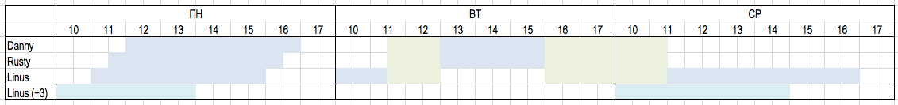

# Задача «0b11 друзей Аркадия»

> Мы очень хотим, чтобы код вы написали сами, а не пользовались внешними библиотеками.

## Основное задание

Три компаньона Аркадия – «Danny», «Rusty» и «Linus» – частенько проворачивают тёмные делишки под покровом ночи:
пишут на PHP, едят после шести и изредка грабят банки.

Сегодня они подумали, что настало время завязать с тёмными делами. Поэтому решили пойти на последнее ограбление,
а после изучить `JavaScript` и стать законопослушными фронтедерами.

Сейчас уже понедельник, а в четверг в последний банк поставят новую сигнализацию.
И у них есть только три дня (понедельник, вторник и среда), чтобы выбрать подходящее время.
Во-первых, это должно быть в рабочие часы банка – так легче проникнуть в него.  
Во-вторых, все трое должны быть свободны.  
И в-третьих, должно быть достаточно времени, чтобы провернуть дело.

Компаньоны быстро составили расписание – когда и кто занят  
(заметьте, что грабители находятся в разных часовых поясах):

```json
{
  "Danny": [
    { "from": "ПН 12:00+5", "to": "ПН 17:00+5" },
    { "from": "ВТ 13:00+5", "to": "ВТ 16:00+5" }
  ],
  "Rusty": [
    { "from": "ПН 11:30+5", "to": "ПН 16:30+5" },
    { "from": "ВТ 13:00+5", "to": "ВТ 16:00+5" }
  ],
  "Linus": [
    { "from": "ПН 09:00+3", "to": "ПН 14:00+3" },
    { "from": "ПН 21:00+3", "to": "ВТ 09:30+3" },
    { "from": "СР 09:30+3", "to": "СР 15:00+3" }
  ]
}
```



И нашли в интернете часы работы банка:

```json
{ "from": "10:00+5", "to": "18:00+5" }
```

Но выбрать время для ограбления сходу не получилось, поэтому предлагаем вам написать скриптик с методом
(getAppropriateMoment), который на вход принимает расписание (schedule),
необходимое для ограбления время (time) в минутах и время работы банка (workingHours),
вычисляет подходящее время и на выходе предоставляет объект для работы с ним:

- `.exists()` – отвечает на вопрос найдено ли время вообще
- `.format(template)` – выводит время ограбления в часовом поясе банка и согласно переданному шаблону,
  который может включать в себя часы **HH**, минуты **MM** и день недели **DD**.
  Например, _«Начинаем в %HH:%MM (%DD)»_. Если время не найдено, метод возвращает пустую строку.

**Дополнительные условия и ограничения:**

- Все время задачи ограничено неделей c ПН 00:00 до ВС 23:59 в часовом поясе банка
- Время ограбления должно попадать в промежуток c ПН 00:00 до СР 23:59 в часовом поясе банка
- Банк работает всю неделю
  - Но работает в рамках только одного дня (не может открыться в один день, а закрыться в другой)
  - И может открыться в 00:00, а закрыться аж в 23:59
- Временная зона задана в часах. Всегда целое число и может быть только положительным – «+5»
- Даты приходят всегда правильно, можно опустить обработку неправильных дат и интервалов
- Гарантируется одинаковость часового пояса в одном контексте: в рамках расписания одного члена банды, в рамках часов работы банка
- Закончить ограбление необходимо тоже до конца рабочего дня банка

В файле _index.js_ и в тестах вы можете найти примеры использования получившегося скриптика.

## Дополнительное задание

Реализовать метод `.tryLater()`, который находит следующее подходящее время **через полчаса** от предыдущего.
Если найти не получается, то время остается прежнее. Метод возращает true, если получилось найти и false, если нет.

Не забудьте также установить флаг `isExtraTaskSolved` в значение `true`.

Пример работы этого метода вы может отыскать в [_src/index.js_](./src/index.js) и в [открытых тестах](./test/robbery.spec.js).  
Будет по-настоящему здорово, если вы его осилите!

## Доступные команды

Запускаются так: `npm run <command>`

| Команда       | Действие                                |
| ------------- | --------------------------------------- |
| start         | Запуск src/index.js                     |
| test          | Запуск всех тестов                      |
| test:watch    | Запуск тестов при изменении кода        |
| test:coverage | Проверка уровня покрытия кода тестами   |
| lint          | Проверка кода линтером                  |
| lint-fix      | Исправление ошибок, выявленных линтером |
| format        | Форматирование кода                     |


_Грабить банки – нехорошо, не повторяйте этого дома!_
