# Моделирование роста монокристаллического твердого раствора $Al_xGa_{1-x}N$ методом хлоридной эпитаксии

### Введение

Нитриды металлов $III$ группы – алюминия, галлия и индия – в настоящее время рассматриваются как исключительно перспективные материалы для производства широкого класса полупроводниковых оптоэлектронных и силовых приборов нового поколения с уникальными рабочими характеристиками. К числу таких приборов относятся твердотельные лазеры, светодиоды, мощные высокочастотные транзисторы, диоды Шоттки и т.д. Важнейшая роль этих материалов была косвенно подчеркнута присуждением Нобелевской премии по физике 2014 г. трем японским ученым «за создание энергосберегающих и экологически безвредных источников света - синих светодиодов (LED)» – приборов, которые удалось разработать только на основе $III$-нитридов.

Среди $III$-нитридов особую роль играет твердый раствор нитрида алюминия ($AlN$) и нитрида галлия ($GaN$) – т.н. алган ($Al_xGa_{1-x}N$ = $(AlN)_x(GaN)_{1-x}$). Этот материал служит основой для создания коротковолновых (до глубоко ультрафиолетового диапазона) оптоэлектронных приборов, которые находят применение в самых разных современных оптических технологиях. Однако, создание приборных структур на основе алгана требует управляемого выращивания очень тонких (до одного монослоя) монокристаллических слоев материала заданной толщины и состава, что является чрезвычайно сложной технологической задачей. Одним из перспективных подходов к решению этой задачи служит т.н. хлоридная эпитаксия.

Типовая схема технологического процесса хлоридной эпитаксии приведена на Рис. 1. В источники, содержащие твердый алюминий ($Al$) и жидкий галлий ($Ga$), нагретые до температур порядка 550 °С и 850 °С, соответственно, подается хлороводород ($HCl$), разбавленный химически инертным несущим газом – азотом ($N2$). При этом в источнике алюминия в результате (обратимых) поверхностных химических реакций

$$
2Al(solid) + 2HCl \Leftrightarrow 2AlCl + H_2
$$
$$
Al(solid) + 2HCl \Leftrightarrow AlCl_2 + H_2
$$
$$
2Al(solid) + 6HCl \Leftrightarrow 2AlCl_3 + 3H_2
$$
образуются газообразные хлориды алюминия – $AlCl$, $АlC_l2$ и $AlCl_3$ – активные летучие соединения, из которых далее растет $AlN$-составляющая алгана. В источнике галлия в результате аналогичных реакций
$$
2Ga(liquid) + 2HCl \Leftrightarrow 2GaCl + H_2
$$
$$
Ga(liquid) + 2HCl \Leftrightarrow GaCl_2 + H_2
$$
$$
2Ga(liquid) + 6HCl \Leftrightarrow 2GaCl_3 + 3H_2
$$
образуются газообразные хлориды галлия – $GaCl$, $GaCl_2$ и $GaCl_3$, из которых далее растет $GaN$-составляющая алгана. Параллельно по отдельным каналам в реактор подается аммиак ($NH_3$) и несущий азот, которые могут быть разбавлены водородом ($H_2$). Все подаваемые газы смешиваются и направляются в рабочую зону реактора, прогретую до температуры порядка 1100 °С, где располагается монокристаллическая (обычно сапфировая) подложка. На этой подложке собственно и происходит рост алгана в результате параллельного протекания следующих поверхностных реакций
$$
AlCl + NH_3 \Leftrightarrow AlN(solid) + HCl + H_2
$$
$$
2AlCl_2 + 2NH_3 \Leftrightarrow 2AlN(solid) + 4HCl + H_2
$$
$$
AlCl_3 + NH_3 + \Leftrightarrow AlN(solid) + 3HCl
$$
$$
GaCl + NH_3 \Leftrightarrow GaN(solid) + HCl + H_2
$$
$$
2GaCl_2 + 2NH_3 \Leftrightarrow 2GaN(solid) + 4HCl + H_2
$$
$$
GaCl_3 + NH_3 \Leftrightarrow GaN(solid) + 3HCl
$$

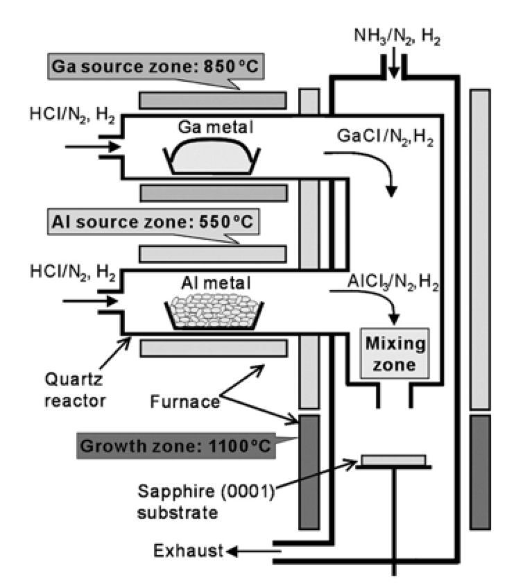
$Рис. 1 (Схема\ технологического\ процеса\ хлоридной\ эпитаксии\ алгана)$

Точное «предсказательное» моделирование хлоридной эпитаксии алгана требует детального описания газовой динамики, теплообмена, многокомпонентной диффузии, поверхностной кинетики и некоторых других физических процессов. Однако, как выяснилось в ходе расчетов, многие экспериментально наблюдаемые особенности процесса могут быть воспроизведены и объяснены в рамках простой приближенной модели, сводящейся к решению трех однотипных нелинейных систем алгебраических уравнений.

## Цели и задачи

В данном курсовом проекте предлагается провести моделирование хлоридной эпитаксии алгана на основе приближенной модели процесса, и, в конечном счете, объяснить обнаруженное в экспериментальной работе [A. Koukitu et. al.] - **TODO** явление резкого смещения состава алгана в сторону компоненты $AlN$ при незначительном добавлении водорода в несущий азот.

## Задание 1. Моделирование конверсии HCl в хлориды алюминия

Для нахождения межфазных потоков $G_i$ воспользуемся следующей формулой:

$$
G_i = D_i {(P^g_i - P^e_i)\over R T \delta}
$$
Для ее применения нам необходимо найти термодинамические давления $P_i^e$. Выразим температурно-зависимые константы равновесия реакций $K_j(T)$ соответствующие формулам $(1)-(3)$ из законов действующих масс:
$$
𝐾_1={(𝑃^{\ e}_{𝐻𝐶𝑙})^2\over(𝑃^{\ e}_{Al𝐶𝑙})^2𝑃^{\ e}_{𝐻_2}}
$$
$$
𝐾_2={(𝑃^{\ e}_{𝐻𝐶𝑙})^2\over𝑃^{\ e}_{Al𝐶𝑙_2}𝑃^{\ e}_{𝐻_2}}
$$
$$
𝐾_3={(𝑃^{\ e}_{𝐻𝐶𝑙})^6\over(𝑃^{\ e}_{Al𝐶𝑙_3})^2(𝑃^{\ e}_{𝐻_2})^3}
$$
Дополнив уравнения $(14)-(16)$ стехиометрическими соотношениями:
$$
D_{HCl}(P^g_{HCl}-P^e_{HCl})+2D_{H_2}(P^g_{H_2}-P^e_{H_2})=0
$$
$$
D_{AlCl}(P^g_{AlCl} - P^e_{AlCl}) + 2D_{AlCl_2}(P^g_{AlCl_2} - P^e_{AlCl_2}) + 3D_{AlCl_3}(P^g_{AlCl_3} - P^e_{AlCl_3}) + D_{HCl}(P^g_{HCl} - P^e_{HCl}) = 0
$$
получим систему для нахождения термодинамических давлений для $AlCl, AlCl_2, AlCl_3, HCl, H_2$.

Далее, с помощью полученных данных и нижеприведенной формулы, можно вычислить скорость испарения алюминиевого источника:
$$
V^e_{Al} = (G_{AlCl} + G_{AlCl_2} + G_{AlCl_3})({\mu_{Al}\over\rho_{Al}})*10^9
$$

Взяв за основу следующие значения:
$P_{AlCL}^g=P_{AlCL_2}^g=P_{AlCL_3}^g=P_{H_2}^g=0$, $P_{HCl}^g=10000$ Па, $P_{N_2}^g=190000$ Па, $P=P_{HCl}^g+P_{N_2}^g=100000$ Па, $\delta=0.01$м, $T=350...650^\circ C$, путем применения правила Гиббса для формул $(1)-(3)$ и простых преобразований, описанных в задании, получаем значения соответствующих констант равновесия реакций:
$$
𝐾_1(T)=\frac {\exp \frac {-\Delta G_1(T)} {RT}} {P_A}
$$

$$
𝐾_2(T)=\exp \frac {-\Delta G_2(T)} {RT}
$$

$$
𝐾_3(T)=\exp \frac {-\Delta G_3(T)} {RT}P_A
$$

Так как мы хотим найти $P_{AlCl}^e, P_{AlCl_2}^e, P_{AlCl_3}^e$, избавляемся от остальных термодинамических давлений в нашей системе из уравнений $(14)-(18)$. Также, используя элементарные преобразования и подстановки, полученная система сводится к нахождению лишь одной переменной $P_{AlCl}^e$:

$L = D_{AlCl}(P^g_{AlCl} - P^e_{AlCl}) + 2D_{AlCl_2}(P^g_{AlCl_2} - P^e_{AlCl_2}) + 3D_{AlCl_3}(P^g_{AlCl_3} - P^e_{AlCl_3})$ (из уравнения $(18)$ без $D_{HCl}$)
$$
\begin{cases}
P_{AlCl_2}^e=\frac {K_1(P_{AlCl}^e)^2} {K_2} \\
P_{AlCl_3}^e=(P_{AlCl}^e)^3\sqrt\frac {K_1^3} {K_3} \\
L = D_{AlCl}(P_{AlCL}^g + P_{AlCL}^e) + 2D_{ALCl_2}(P_{AlCL_2}^g - \frac {K_1(P_{AlCL}^e)^2} {K_2} + 3 D_{AlCL_3}(P_{AlCL_3}^g-(P_{AlCL}^e)^3\sqrt \frac {K_1^3} {K_3}) \\
2D_{H_2}(D_{HCl}P_{HCl}^g+L)^2=K_1(P_{AlCL}^e)^2D_{HCl}^2(2D_{H_2}P_{H_2}^g-L)
\end{cases}
$$

Полученная система решалась методом Ньютона. Результаты выполнения вычислений:

Диаграммы Аррениуса для межфазных потоков Al-компонент:

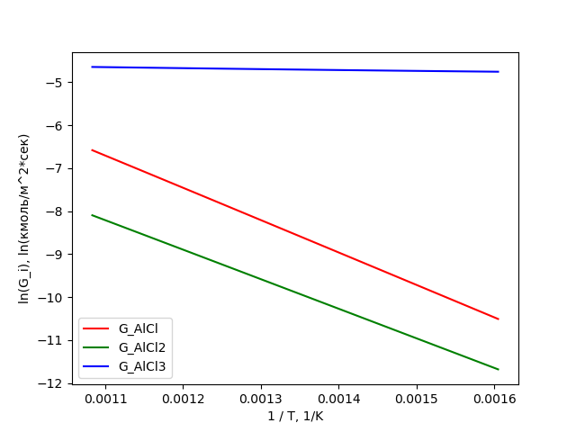

Диаграмма Аррениуса скорости испарения источника Al:

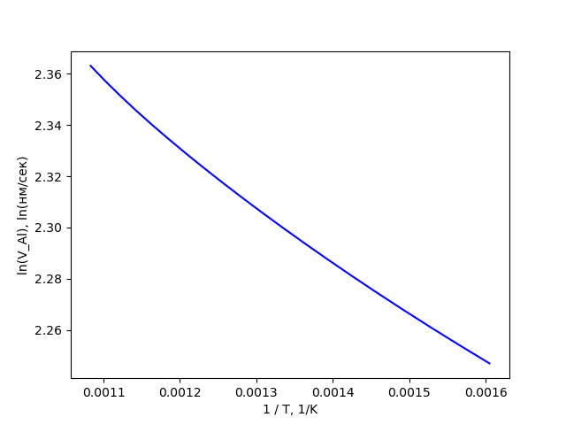

Благодаря первому графику, мы можем наглядно убедиться, что преобладающим Al-содержащим компонентом, выходящим из источника, является трихлорид алюминия $(AlCl_3)$.

## Задание 2. Моделирование конверсии HCl в хлориды галлия

Так как алюминий$(Al)$ и галлий$(Ga)$ элементы одной группы$(III)$ периодической таблицы и идентично влияют на описанные реакции, уравнения $(1)-(3)$ эквивалентны уравнениям $(4)-(6)$, а уравнения $(7)-(9)$ - уравнениям $(10)-(12)$ относительно элементов реакций, результирующих продуктов и их коэффициентов. Благодаря этому, все вычисления, описанные выше для алюминия, можно спроецировать на уравнения с галлием. В итоге, подставив вместо алюминия галлий в последнюю систему и решив ее, мы пришли к следующим результатам:

Диаграммы Аррениуса для межфазных потоков Ga-компонент:

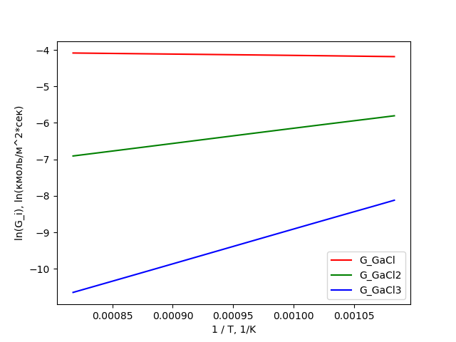

Диаграмма Аррениуса скорости испарения источника Ga:

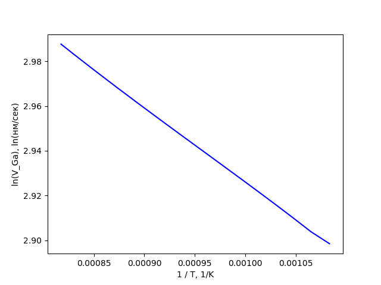

Благодаря первому графику, мы можем наглядно убедиться, что преобладающим Ga-содержащим компонентом, выходящим из источника, является монохлорид галлия $(GaCl)$.

Критерием окончания метода Ньютона служила малость нормы двух последовательных приближений, где в качестве нормы используется 2-норма векторов, а значение $\epsilon = 1e-12$. Также для метода было установлено ограничение в 1000 итераций.

## Задание 3. Моделирование роста твердого раствора $Al_xGa_{1-x}N$ – алгана

Из полученных результатов, мы видим, что преобладающими элементами, образующимися на предыдущих этапах хлоридной эпитаксии являются $\text{AlCl}_3$ и $\text{GaCl}$. Таким образом, основными реакциями, происходящими в рабочей зоне реакторе являются (9) и (10).

Перед тем как найти значения межфазных потоков $G_{\text{AlCl}_3}$ и $G_{GaCl}$ по формуле (13), необходимо вычислить коэффициенты диффузии и термодинамические давления для соответствующих газовых компонент.

Коэффициенты диффузии считаем по формуле из приложения (b), приняв за то, что в реакторе процессы проходят при температуре $T = 1100^{\circ}\text{C} = 1373.15^{\circ}\text{K}$.

Для вычисления термодинамических давлений построим систему из следующих уравнений:

Выпишем законы действующих масс для реакций (9) и (10), считая, что газы являются идеальными:

$$P_{\text{AlCl}_3}^e \cdot P_{\text{NH}_3}^e = K_9x(P_{\text{HCl}}^e)^3$$
$$P_{\text{GaCl}}^e \cdot P_{\text{NH}_3}^e = K_{10}(1-x)P_{\text{HCl}}^eP_{\text{H}_2}^e$$

Константы равновесия $K_9, K_{10}$ - здесь выводятся, если явно выписать данные законы с помощью правил Гиббса.

$$K_9(T) = exp[-\Delta G_9(T) / RT] / P_A$$
$$K_{10}(T) = exp[-\Delta G_9(T) / RT]$$
где 
$$\Delta G_9(T) = G_{\text{AlCl}_3}(T) + G_{\text{NH}_3}(T) - G_{\text{AlN(s)}}(T) - 3G_{\text{HCl}}(T)$$
$$\Delta G_10(T) = G_{\text{GaCl}}(T) + G_{\text{NH}_3}(T) - G_{\text{GaN(s)}}(T) - G_{\text{HCl}}(T) - G_{\text{H}_2}(T)$$
$G_i(T)$ - энергия Гиббса для $i$-ой компоненты

Выпишем стехиометрические соотношения на ростовой поверхности, обеспечивающие "невхождение"
элементов H и Cl в алган:

$$D_\text{HCl}(P_{\text{HCl}}^g - P_{\text{HCl}}^e) + 
2D_{\text{H}_2}(P_{\text{H}_2}^g - P_{\text{H}_2}^e) + 
3D_{\text{NH}_3}(P_{\text{NH}_3}^g - P_{\text{NH}_3}^e)=0$$

$$3D_{\text{AlCl}_3}(P_{\text{AlCl}_3}^g - P_{\text{AlCl}_3}^e) + 
D_{\text{Gacl}}(P_{\text{GaCl}}^g - P_{\text{GaCl}}^e) + 
D_\text{HCl}(P_{\text{HCl}}^g - P_{\text{HCl}}^e)=0$$

Добавим условие равенства межфазного потока элементов Al и Ga и межфазного потока элемента N

$$D_{\text{AlCl}_3}(P_{\text{AlCl}_3}^g - P_{\text{AlCl}_3}^e) + 
D_{\text{Gacl}}(P_{\text{GaCl}}^g - P_{\text{GaCl}}^e) = 
D_{\text{NH}_3}(P_{\text{NH}_3}^g - P_{\text{NH}_3}^e)$$

Выпишем условие связи межфазных потоков элементов Al и Ga и доли компонент $x$ AlN и $1-x$ GaN
в твердом растворе $\text{Al}_x\text{Ga}_{1-x}\text{N}$

$$\frac{D_{\text{AlCl}_3}(P_{\text{AlCl}_3}^g - P_{\text{AlCl}_3}^e)}
{D_{\text{Gacl}}(P_{\text{GaCl}}^g - P_{\text{GaCl}}^e)} = \frac{x}{1-x}$$

Таким образом получаем систему из $6$ уравнений:

$$
\begin{cases}
P_{\text{AlCl}_3}^e \cdot P_{\text{NH}_3}^e - K_9x(P_{\text{HCl}}^e)^3 = 0 \\

P_{\text{GaCl}}^e \cdot P_{\text{NH}_3}^e - K_{10}(1-x)P_{\text{HCl}}^eP_{\text{H}_2}^e = 0 \\

D_\text{HCl}(P_{\text{HCl}}^g - P_{\text{HCl}}^e) + 
2D_{\text{H}_2}(P_{\text{H}_2}^g - P_{\text{H}_2}^e) + 
3D_{\text{NH}_3}(P_{\text{NH}_3}^g - P_{\text{NH}_3}^e) = 0 \\

3D_{\text{AlCl}_3}(P_{\text{AlCl}_3}^g - P_{\text{AlCl}_3}^e) + 
D_{\text{Gacl}}(P_{\text{GaCl}}^g - P_{\text{GaCl}}^e) + 
D_\text{HCl}(P_{\text{HCl}}^g - P_{\text{HCl}}^e) = 0 \\

D_{\text{AlCl}_3}(P_{\text{AlCl}_3}^g - P_{\text{AlCl}_3}^e) + 
D_{\text{Gacl}}(P_{\text{GaCl}}^g - P_{\text{GaCl}}^e) - 
D_{\text{NH}_3}(P_{\text{NH}_3}^g - P_{\text{NH}_3}^e) = 0 \\

D_{\text{AlCl}_3}(P_{\text{AlCl}_3}^g - P_{\text{AlCl}_3}^e) \cdot (1-x) - 
D_{\text{Gacl}}(P_{\text{GaCl}}^g - P_{\text{GaCl}}^e)\cdot x = 0
\end{cases}
$$

Данная система задана относительно $6$ неизвестных $P_{\text{AlCl}_3}^e, P_{\text{GaCl}}^e, P_{\text{NH}_3}^e, P_{\text{HCl}}^e, P_{\text{H}_2}^e, x$

Считаем, что в данной зоне реактора парциальные давления компонент следующие: 

$P_{\text{HCl}}^g = 0$, 

$P_{\text{NH}_3}^g = 1500$, 
$P_{\text{AlCl}_3}^g + P_{\text{GaCl}}^g = 30$, 
$P_{\text{H}_2}^g + P_{\text{N}_2}^g = 98470$

При этом рассмотрим результаты вычислений, при различных долях подаваемого вещества $\text{AlCl}_3$ в источник (параметр $x^g = \frac{P_{\text{AlCl}_3}^g}{P_{\text{AlCl}_3}^g + P_{\text{GaCl}}^g}$). А также рассмотрим два различных случая, когда доля $\text{H}_2$ в газе-носителе равна $0$ и $0.1$.

Построенную систему решим с помощью метода Ньютона на приведенных данных, варьируя коэффициент $x^g$ от $0$ до $1$, с вычислением локальных минимумов на каждой итерации для лучшей сходимости метода.

Построим графики зависимости $G_{\text{AlCl}_3}, G_{\text{GaCl}}, x, V_{\text{Al}_x{Ga}_{1-x}N}$ от $x^g$:
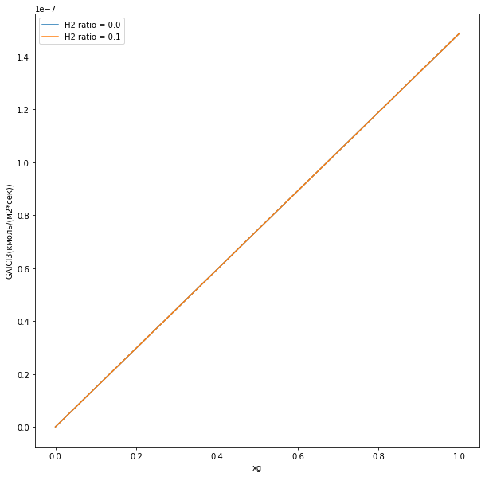

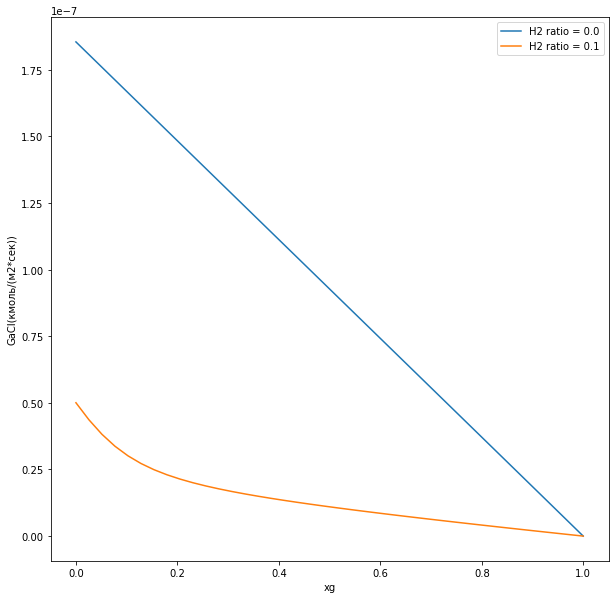

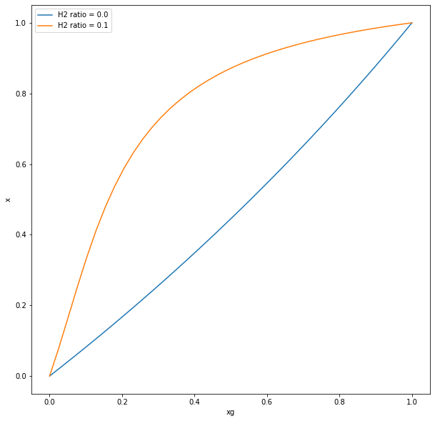

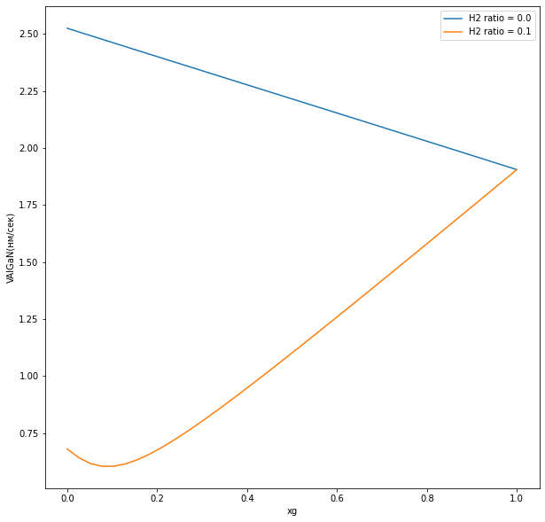

По графикам видим, что диаграмма вхождения алюминия в кристалл при отсутствии водорода в газе-носителе близка к линейной, а при добавлении небольшого количества водорода представляет собой выпуклую линию, т.е. доля алюминия   в кристалле превышает долю $\text{AlCl}_3$ в газообразных хлоридах.

Добавление небольшого количества водорода практически не влияет на мольный поток компоненты хлорида алюминия (графики почти совпали, при сильном приближении будут заметна разница, но она очень мала), но значительно меняет поведение потока хлорида галлия. 

При рассмотрении уравнений реакции, видим, что в (R9) водород не участвует, а в (R10) присутствует как продукт реакции. При увеличении парциального давления водорода, соответственно увеличится термодинамическое давление. Увеличение $P_{\text{H}_2}^e$ в свою очередь в уравнении равновесия реакции (R10) приведет к увеличению термодинамического давления компоненты $GaCl$, что соответственно уменьшит его разницу с парциальным давлением и уменьшит его парциальный поток. Благодаря уменьшению потока галлиевой компоненты доля вхождения алюминия в раствор алгана будет превосходить в сравнении со случаем, когда водород отсутствует в газе-носителе.

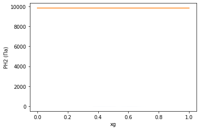 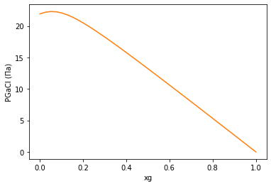

Полученные теоретические результаты соответствуют экспериментальной работе [A. Koukitu et. al.].

Вывод: 

Были подсчитаны все необходимые межфазные потоки для Al-содержащих и Ga-содержащих компонент и скорости испарения источников. Благодаря этому можно утверждать, что преобладающим Al-содержащим компонентом действительно является трихлорид алюминия $(AlCl_3)$, а преобладающим Ga-содержащим компонентом - монохлорид галлия $(GaCl)$.

Найдены межфазные потоки на ростовой поверхности и скорость роста слоя. Построены диаграммы вхождения алюминия в кристалл при разных $P_{H_2}^g$ и проанализированы из графики. Все результаты сопоставлены с экспериментальными данными [работы](#asd).

## Литература

1. Бахвалов Н.С. Численные методы (анализ, алгебра, обыкновенные дифференциальные уравнения). М.: Наука, 1975.

2. Калиткин Н.Н. Численные методы. М.: Наука, 1978.

3. T. Yamane, F. Satoh, H. Murakami, Y Kumagai, and A. Koukitu. J. Cryst. Growth 300 (2007) 164–167.

4. A.S. Segal, D.S. Bazarevskiy, M.V. Bogdanov, and E.V. Yakovlev. Phys. Stat. Solidi (c) 6 (2009) S329-S332.
