# Домашнее задание 1

## Задание 1

Многочлен $P_n(x) = 9 x^5 - 19 x^4 - 15 x^3 + 6 x^2 + 18 x - 1$ (коэффициенты подобраны случайно)

#### Локализация

Для локализации рассмотрим график $y(x) = 9 x^5 - 19 x^4 - 15 x^3 + 6 x^2 + 18 x - 1$

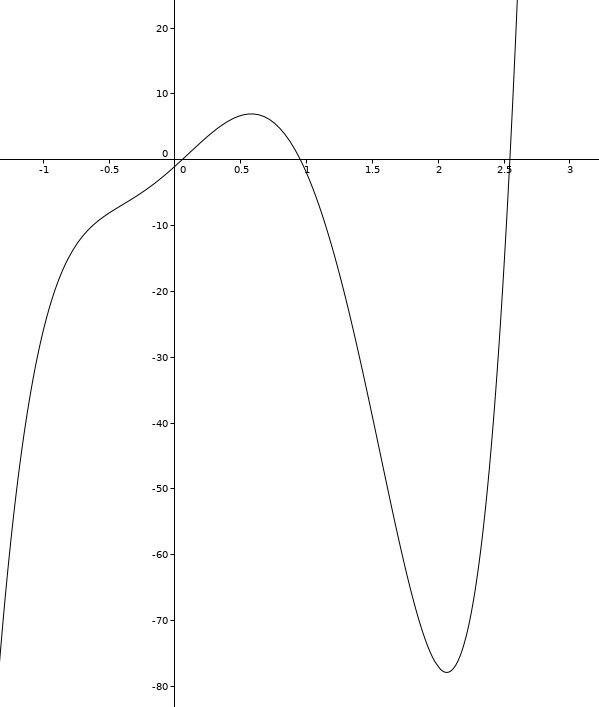

Исходя из графика, выберем следующие отрезки : $[0;0.5],\ [0.5;1],\ [2.5;3]$

#### Нахождение корней методом Ньютона

$x_{n + 1} = x_n - {f(x_n) \over f'(x_n)} = x_n - {P_n(x_n) \over P_n'(x_n)}, \ \epsilon = 10^{-6}$

| итерации |  $[0; 0.5]$  |  $[0.5; 1]$  |  $[2.5; 3]$  |
| :------: | :----------: | :----------: | :----------: |
|    1     | 0.0555555556 | 0.9565217391 | 2.7181964573 |
|    2     | 0.0547038071 | 0.9535880624 | 2.5805022265 |
|    3     | 0.0547036825 | 0.9535746571 | 2.5463736795 |
|    4     |      -       | 0.9535746568 | 2.5444097003 |
|    5     |      -       |      -       | 2.5444034177 |
|    6     |      -       |      -       | 2.5444034176 |
|  корень  | 0.0547036825 | 0.9535746568 | 2.5444034176 |

Значения получены из программы, в качестве начального приближения бралось такое $x_0$, что $f(x_0) f(x_0)'' = P_n(x_0) P_n(x_0)'' > 0$

## Задание 2

Будем везде брать $x_0 = 0.5$

1. $0 < r < 1$

   + Возьмём  $r = 0.5$
     
     $\phi(x) = {1 \over 2} x (1 - x)$

     $\phi'(x) = {1 \over 2} - x$

     По теореме о сходимости метода простых итераций итерационная последовательность сходится к корню $x = 0$, так как на отрезке $x \in [0 - \delta, 0 + \delta]$ проихводная $\phi'(x)$ непрерывна и $|\phi'(x)| < 1$

     Путь итерационной последовательности: 
     
     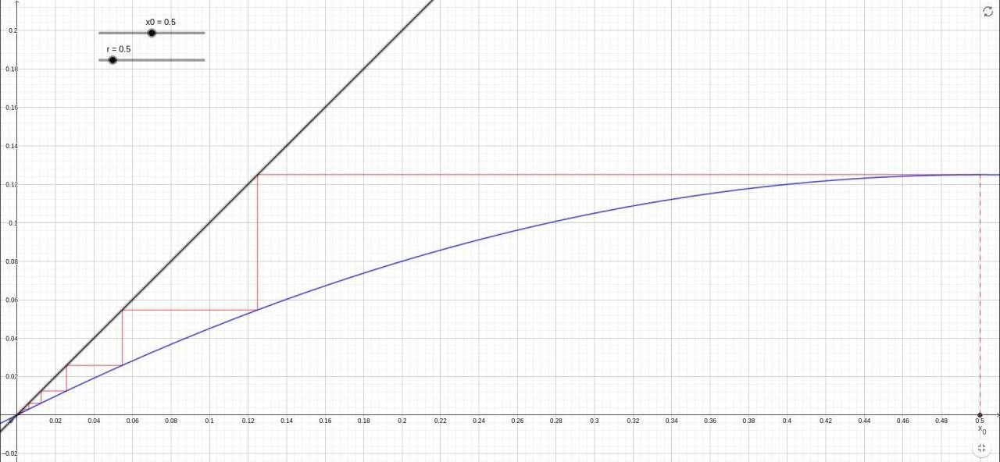
     
     График: i -> $x_i$
     
     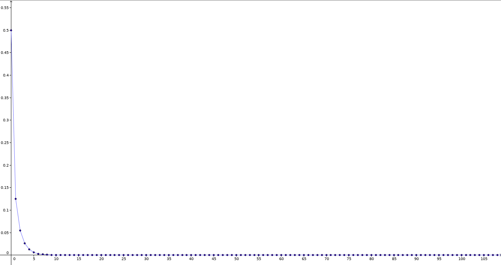
     
     

2. $1 < r < 3$

   - $1 < r < 2$

     Пусть $r = 1.5$

     $\phi(x) = {3 \over 2} x (1 - x)$

     $\phi'(x) = {3 \over 2} - 3x$

     При $x \in [{1 \over 3} - \delta, {1 \over 3} + \delta]$ производная непрерывна и $|\phi'(x)| < 1$ $\implies$ по теореме о сходимости метода простых итераций последовательность сходится к корню $x = {1 \over 3}$

     Путь итерационной последовательности: 
     
     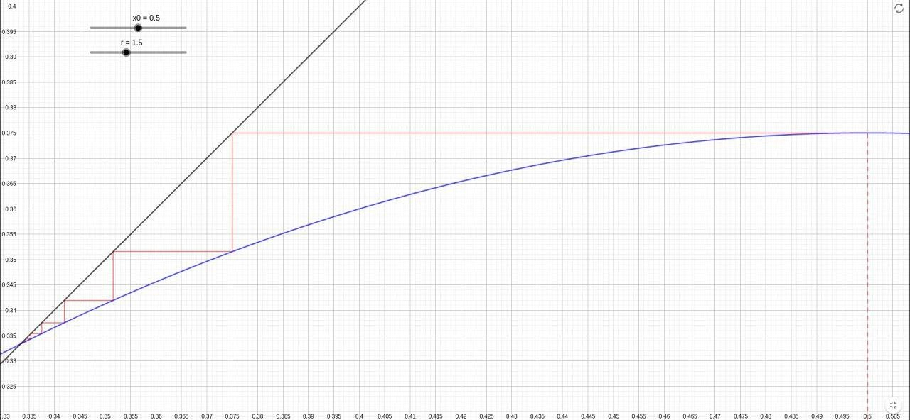
     
     График: i -> $x_i$
     
     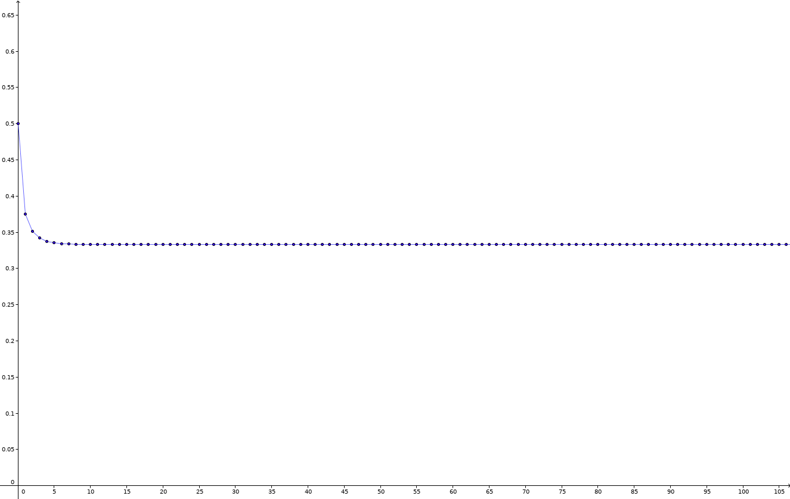
     
     
     
     График иллюстрирует монотонную сходимость.
     
   - $2 < r < 3$

     пусть $r = 2.5$

     $\phi(x) = {5 \over 2} x (1 - x)$

     $\phi'(x) = {5 \over 2} - {5 \over x}$

     Аналогично итерационная последовательность сходится к корню $x = {3 \over 5}$ , т. к. при $x \in [{3 \over 5} - \delta, {3 \over 5} + \delta]$ производная непрерывна и ее модуль $|\phi'(x)| < 1$ меньше единицы (т.е. выполняется условие Липшица).

     Путь итерационной последовательности: 

     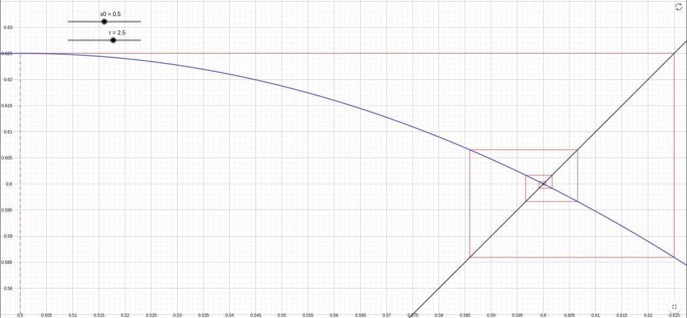

     График: i -> $x_i$
     
     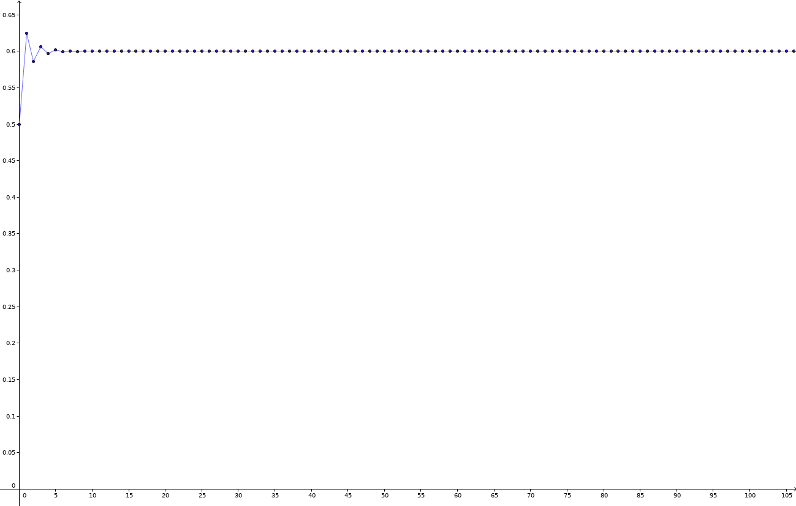
     
     В данном случае мы уже имеем колебательную сходимость.
     
     
     
     

3. При r $\in$ (3; $r_{\infty}$) мы уже не можем применить теорему о сходимости, т.к. не выполняется условие Липшица $\implies$ итерационная последовательность не сходится к одному корню. Она распадается на 2, 4, 8... подпоследовательностей, каждая из которых имеет свой предел. Это можно проследить на графике:

   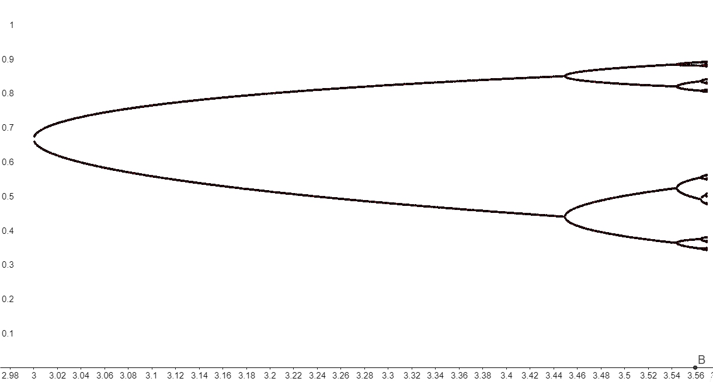>

4. Покажем, что в диапозоне $r_\infty < r < 4$ поведение итерационной последовательности становится похожим на случайное (детерминированный хаос):

   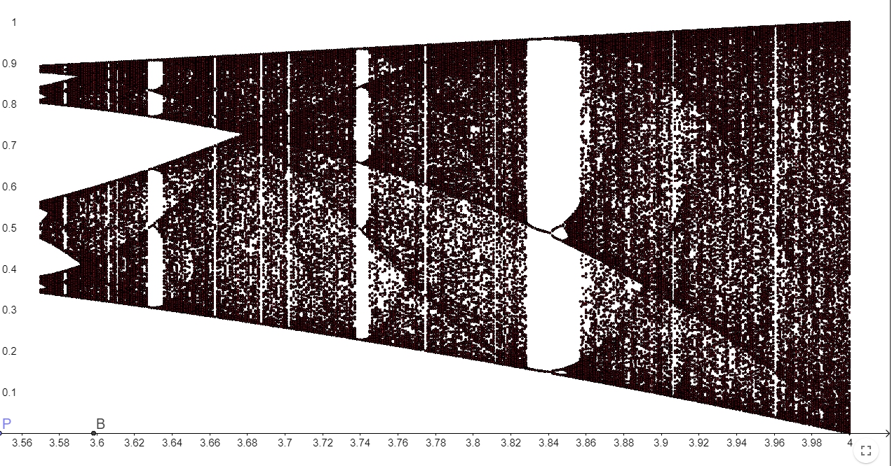

Также заметим, что если рассмотреть один из подпромежутков, то при некоторых значениях $r$ 	имеются области сгущения и разрежения итерационной последовательсти. Этот график рассматривает часть предыдущего графика для наглядности

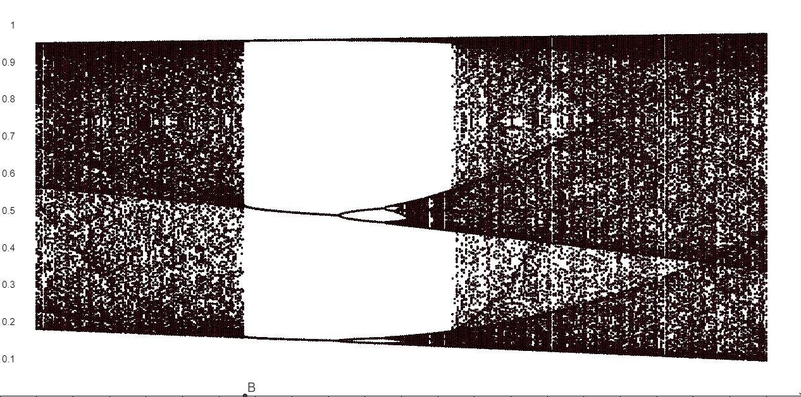

Этот график показывает, что в окрестности $r = 4$ поведение итерационной последовательности становится похожим на белый шум

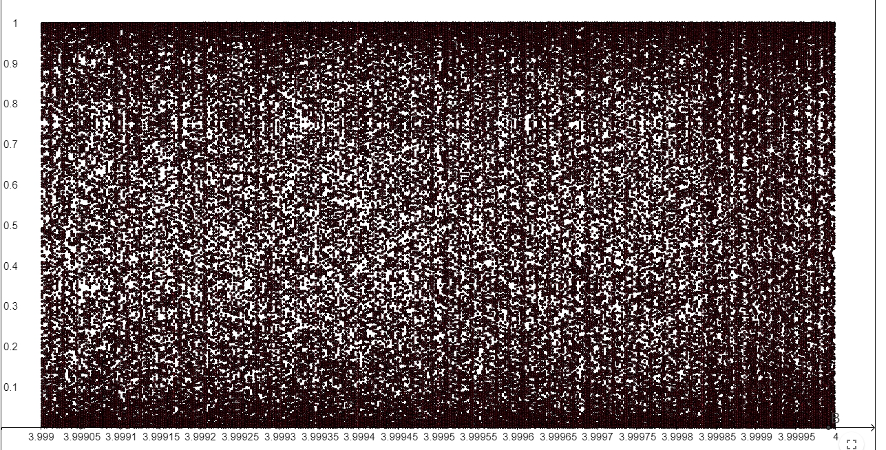

## Задание 3 

Корни находились методом Ньютона, как и в первом задании.

Для каждой точки (пикселя) с помощью метода Ньютона определяли, к какому корню она сходится.
Критерием окончания итераций была малость невязки, то есть $abs(f(z^n) < \epsilon)$.

На легенде указаны цвета, соответствующие корням уравнения.

Можно достичь и большего разрешения графика, но это займёт значительно больше времени.

Для случайных начальных значений: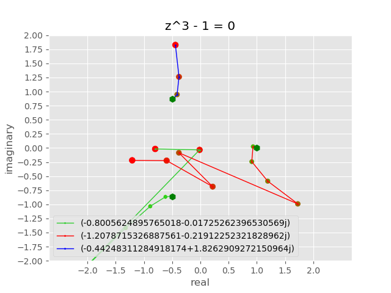
